## Milestone Project 4
**THIS PROJECT IS FOR EDUCATIONAL USE ONLY**

**FANCY DAY DESIGN**
---

For my final project I chose to create a website for my sister-in-law. About 2 years ago she started making balloon decorations. From tiny balloon arches to elaborate themes for birthdays, weddings and other celebrations.<br />

The website focuses on the work of Fancy Day Design but also the simple products that are sold there. The website also features a blog where ideas and comments can be submitted.

This website is for educational purposes only, so
do not attempt to enter real credit card information when using the stripe functionality. For testing purposes you can use the data below:

-   Stripe card number: 4242 4242 4242 4242
-   Any card end date (in the future) you wish
-   Anyy CVV number you wish

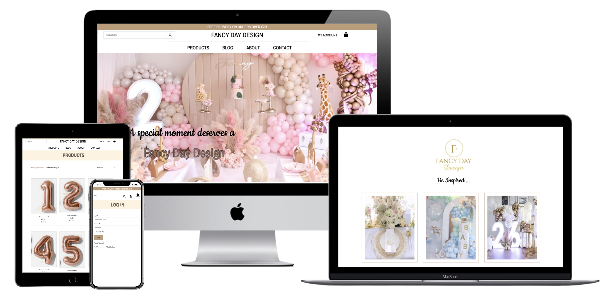

live site [Fancy Day Design](https://fancydaydesign.herokuapp.com/)

# Table of contents

1. [UX](#ux)
    * [strategy](#strategy)
        * [user stories](#user-stories)
        * [site goals](#site-goals)
    * [scope](#scope)
        * [features](#features)
        * [Features Left to Implement](#features-left-to-implement)
    * [structure](#structure)
    * [skeleton](#skeleton)
        * [wireframes](#wireframes)
    * [surface](#surface)
2. [Technologies Used](#technologies-used)
3. [Testing](#testing)
4. [Deployment](#deployment)
5. [Credits](#credits)

# UX <a name="ux"></a>

## Strategy <a name="strategy"></a>

As a final assignment I always said that I would make a website for my sister-in-law. Her decoration business has quickly grown into something big in a short time.
She has indicated what she finds important, what her website should have. I set to work with her wishes and incorporated them into the website. She chose the colors for the website herself. and I was free to choose the different images.

For this website I have created a blog page so that the selected admins can write articles on the site.

Only admin users can make updates and/or delete products or articles on the site. While 'normal' site users review, edit/delete various products and comment on the blog page.

### User Stories <a name="user-stories"></a>

** First time user **
- As a user I want to be able to view a list of all products, so I can select the products I want to buy.
- As a user I want to be able to view a category of all products, so I can find products i'm interested in without having to search through all the products.
- As a user I want to be able to view the product individually, so I can identify product image, price, description and product rating.
- As a user I want to be able to view my shopping bag anytime to see my total, so I can see what my total costs are at any time
- As a user I want to be able to search for a product by keyword, name or descriptions, so I can find a specific product I want to buy.
- As a user I want to be able to select the quantity of a product when purchasing, so I can make sure I don't accidentally buy the wrong product or quantity
- As a user I want to be able to view items in my shopping bag, so I can see the total cost of my purchase and all the items I will receive
- As a user I want to be able to adjust the amount of individual items in my bag, so I can change my purchase before I check out
- As a user I want to be able to simply enter my payment details, so I can pay quickly and easily
- As a user I want to be able to view an order confirmation after checkout, so I can check that I haven't made any mistakes
- As a user I want to be able to receive an email confirmation after checking out, so I can keep the order confirmation of what I bought for my own administration

** Returning Users **
- As a returning user I want to be able to easily register for an account, so i can view my profile and have a personal account
- As a returning user I want to be able to login or logout, so I can access my personal account.
- As a returning user I want to be able to recover my password in case I forget it, so I can restore access to my account
- As a returning user I want to be able to receive an email confirmation after registering, so I can verify that my account registration was successful
- As a returning user I want to be able to have a user profile, so I can view my personal order history and order confirmations.
- As a returning user I want to be able to leave a comment on the website, so I can comment and read from other site users

### Site Goals <a name="site-goals"></a>

- As a site owner i want to be able to add a product, so I can add new items to my shop
- As a site owner i want to be able to edit/update a product, so I can update/edit a product when necessary. 
- As a site owner i want to be able to delete a product, so I can remove items that are no longer available.

## Scope <a name="scope"></a>
---
### Features <a name="features"></a>

##### Navbar

The navigation bar is visible on all pages. On a smaller device/page, it turns into a bar. The navigation bar contains a search bar, the name of the website (Fancy Day Design), a link to your account and a shopping bag.

The footer contains three sections, the first section contains the location of the store, in the middle section you will find links that lead you to different pages of the website and the third section refers to the social media links.
There is a search bar on every page, you can easily search products by name and/or keyword.

##### Delivery Information Banner
The delivery information banner appears at the top of the navigation bar on every page and is fully mobile responsive and responsive to screen size changes.
The delivery banner gives a clear message that the user has to spend €25 euros to get free delivery.

##### Footer
The footer contains three sections, the first section contains the location of the store, in the middle section you will find links that lead you to different pages of the website and the third section refers to the social media links.
There is a search bar on every page, you can easily search products by name and/or keyword.

##### Home page
On the homepage you will find a hero image with the motto of Fancy Day Design. Then 3 images to be inspired. At the bottom of the homepage are testimonials from happy customers.

##### Products

###### All Products
The navigation bar at the top of the page shows all product categories on the site for ease of use for the user. The categories to choose from are;
*   Balloons 0-9
*   Balloons A-Z
*   Custom Made Balloons
*   More Balloons and
*   All Products

The 'All products' view shows every item for sale on the site.

A user can sort the products throughout the site by name and price by choosing from the select drop-down menu at right side of the page.

###### Product details page
The product detail page contains all information related to the product, quantity  and a button for adding the product to the shopping bag.

###### Reviews section
Anyone can view the reviews of the products. When a review has been given about a certain product, it will be at the bottom of the page. Only logged in users can leave a product review in this section.

##### Blog page
The blog page contains short summarized articles about Fancy Day Design. when you click on "read the full blog post" it will take you to the full article. 

The blog post also shows any comments made on the post. Any user can read and leave a comment.

###### About Page
On this page you will find information about who Fancy Day design is. Also on this page is a small gallery. Clicking on the image, will open the image on another page.

###### Bag
In the top right navigation bar there is a bag icon. Once a user adds an item to the bag, the number of added products will be added to the top of the bag
to stand. When a user clicks on the bag icon, they are taken to the bag page.

When a user clicks the bag icon while they have no items in the bag a message will appear stating "There are no products in your bag yet. Check out our products!" below the message will be a button that will direct you back to the products page.

###### Checkout
When the user has items in his bag, a secure checkout button appears. When he clicks this checkout button, he is taken to the checkout page where he can complete his order and pay for his order via stripe .

When the user completes their order, a loading overlay appears until the order is confirmed. When the order is confirmed, a checkout success page with the details of the order will appear to the user.

## Structure <a name="structure"></a>
The general structure of the site remains the same throughout the project. A background image with CTA will appear on the homepage giving the user a clear intent.
Using bootstrap styling, the forms are rendered the same throughout the site, the review form was designed manually rather than using crispy forms that use bootstrap styling. Only users who are logged in are allowed to leave a product review.
The navigation/navigation bar on mobile devices and desktop views remain the same throughout the site.

Buttons and links are used throughout the site to facilitate navigation between pages and site functionality.

### Features Left to Implement <a name="features-left-to-implement"></a>
-   Entering an email address for newsletter.
-   Adding a Calender for making reservations.
-   
-

## Skeleton <a name="skeleton"></a>
For the user stories [Balsamiq](https://balsamiq.com/) was used to create a nice and simple layout for the desktop and mobile screen.

#### Wireframes <a name="wireframes"></a>
Links to the wireframes can be found here:

Desktop Wireframes <br>
1.  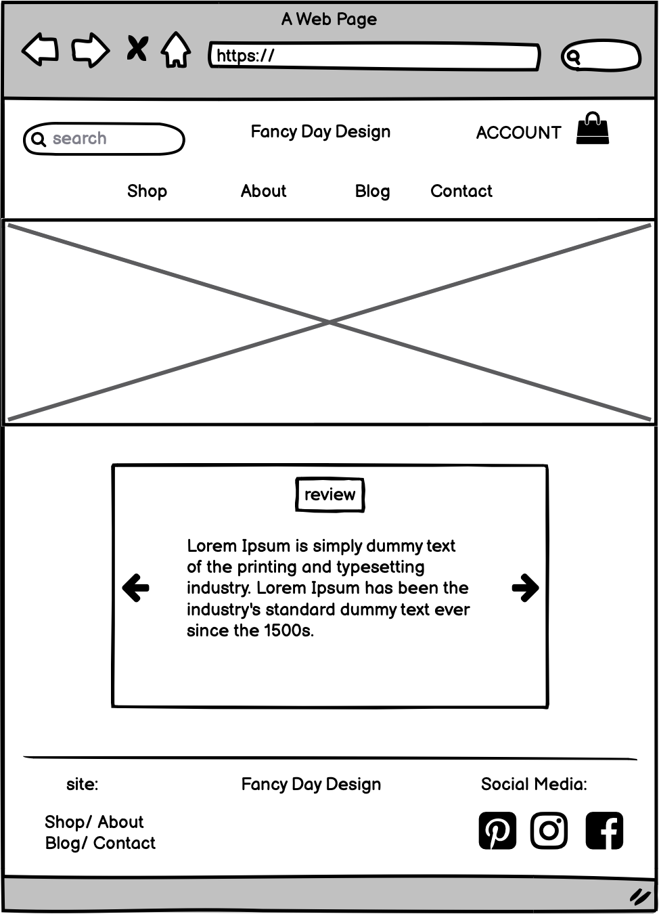
2.  
3.  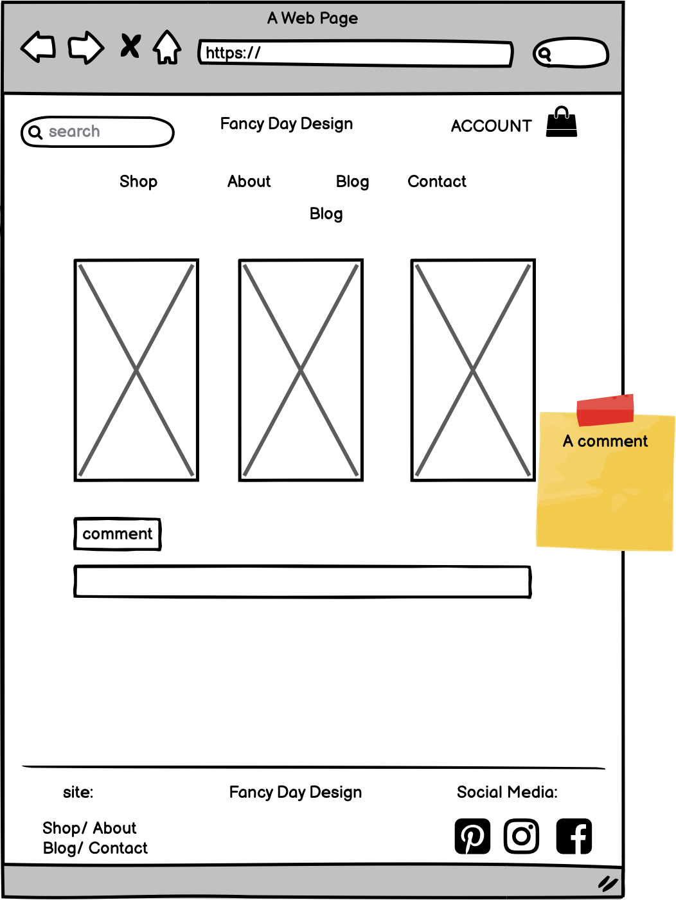
4.  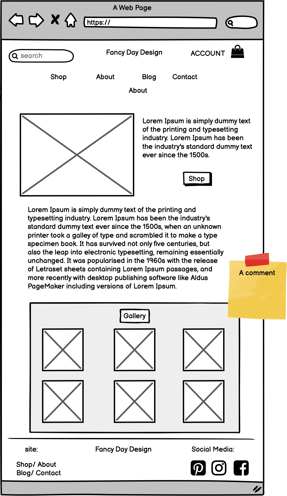
5.  

Desktop Wireframe, for bigger image click here the following numbers [ (1.) ](readme-docs/wireframes/desktop-home.png)[ (2.) ](readme-docs/wireframes/desktop-products.pn)[ (3.) ](readme-docs/wireframes/desktop-blog.png)[ (4.) ](readme-docs/wireframes/desktop-about.png)[ (5.) ](readme-docs/wireframes/desktop-contact.png)

Tablet Wireframes <br>
1.1  

2.1  

3.1  

4.1  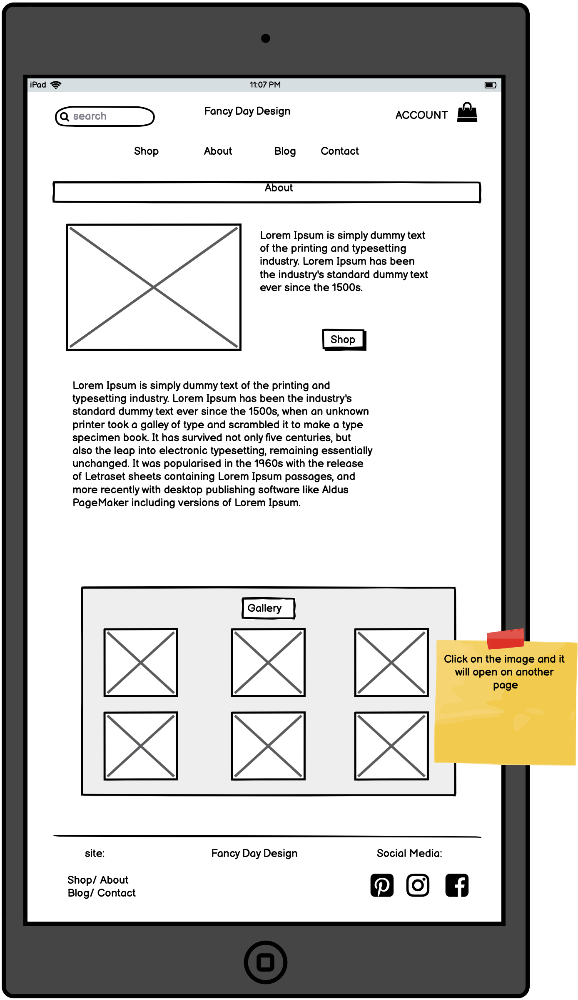

5.1  

Desktop Wireframe, for bigger image click here the following numbers [ (1.1) ](readme-docs/wireframes/tablet-home.png)[ (2.1) ](readme-docs/wireframes/tablet-products.pn)[ (3.1) ](readme-docs/wireframes/tablet-blog.png)[ (4.1) ](readme-docs/wireframes/tablet-about.png)[ (5.1) ](readme-docs/wireframes/tablet-contact.png)

Mobile Wireframe <br>
1a. 

2a. 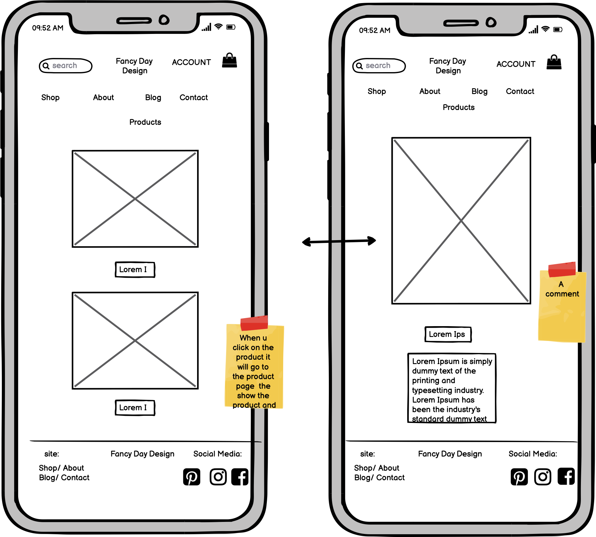

3a. 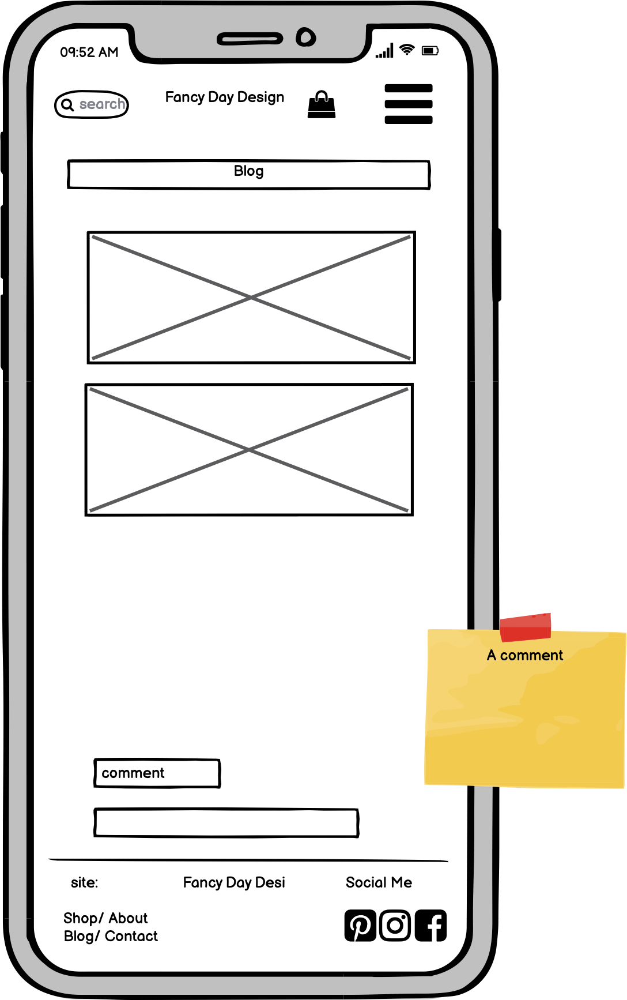

4a. 

5a. 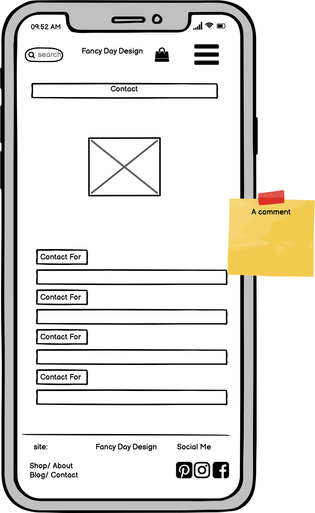

Mobile Wireframe, for bigger image [click here the following numbers [ (1a.) ](readme-docs/wireframes/mobile-home.png)[ (2a.) ](readme-docs/wireframes/mobile-products.png)[ (3a.) ](readme-docs/wireframes/mobile-blog.png)[ (4a.) ](readme-docs/wireframes/mobile-about.png)[ (5a.) ](readme-docs/wireframes/mobile-contact.png)

Note: There were some layout changes. The result is not quite the same as the examples of the wireframes.


## Surface <a name="surface"></a>
For the main foundation of this website I used the videos of Boutique ado. Then this is adapted to the chosen design. I wanted to make the site as simple as possible and process all the points my sister-in-law passed on. A different starting image was first chosen. But I didn't like it that much, so I changed it. The photo that has been chosen fits more with the look of the site.

In the navigation and throughout the website, when clicking on the logo it will lead you back to the homepage. The website generally has a fresh look and is user-friendly.

#### Color Scheme
The main colors used for this website have been selected by Shakira Lacroes (owner).

(Black) 		#231f20
(off-white) 	#fff9f9
(Sand)			#e3d8d2
(Dark Sand)		#c19c77

Logo font - #8d6e63

#### Icons

[FontAwesome](https://fontawesome.com/) was used for forms and buttons, to make it more appealing.

The Fancy Day design logo is used for the favicon. There has been made use of [Favicon](https://favicon.io/) to create this favicon. Images are credited below in the media section.

#### Typography/ Fonts
[Google Fonts](https://fonts.google.com/) was used for the font style of this project. The font used for this website are Archivo Narrow, Cookie and Open Sans with a backup font of Sans-serif. The fonts are simple, playful and easy to read.

# Technologies Used <a name="technologies-used"></a>
The following technologies were used for this website:

## Programming
* [HTML5](https://html.com/) - was used to create the layout and gave the page structure and presenting static data. 

* [CSS](https://en.wikipedia.org/wiki/CSS) - was used to then style the page and make it responsive through media queries, and interactive through using CSS transitions.

* [JavaScript](https://www.javascript.com/) - was used throughout the website to make the site interactive.

* [Python](https://www.python.org/) - was used to build the backend functionality of the web app.

## Libraries
* [Font Awesome](https://fontawesome.com/) - Font Awesome was used to source and find the icons used on the site.

* [jQuery](https://jquery.com/) - was used throughout the website to aid with thefunctionality of certain poages and the features avaliable to end users, Blog, Reviews etc..

## Frameworks
* [Bootstrap](https://getbootstrap.com/) was used to add html/css components to the site and to make the site more visually appealing to the user.
* [Django](https://www.djangoproject.com/) - was used to create my project.
* [EmailJS](https://www.emailjs.com/)
* [Stripe](https://stripe.com/ie) - was useed as the payment section of the site.

* [Django AllAuth](https://django-allauth.readthedocs.io/en/latest/) - was used to create the sign-in and register account functionality of the project.

* [Django Countries](https://pypi.org/project/django-countries/) - was used to select countries in the order form.

* [Django Crispy Forms](https://django-crispy-forms.readthedocs.io/en/latest/) - was used to style form elements.

* [Stripe](https://stripe.com/ie) - was useed as the payment section of the site.

* [Gunicorn](https://gunicorn.org/) - was used to deploy the site to Heroku

## Others
* [Github](https://github.com/) - was used to host and store the source code of the project.

* [Gitpod](https://gitpod.io/) - was the IDE that was used to create this project.

* [Heroku](https://signup.heroku.com/) - was used to deploy the site and host it.

* [AWS](https://aws.amazon.com/) - was used to store the images on the site and the static files.

## Tools used

* [Favicon](https://favicon.io/)

    * Favicon was used to create and add a favicon to the site.

* [Autoprefixer](https://autoprefixer.github.io)

    * Autoprefixer was used to parse my css file and add the vendor prefixes.

* [Balsamiq](https://balsamiq.com/) - was used to set up my wireframe. <br>

* [Google Fonts](https://fonts.google.com/) - was used to select the font for my website.

* [Pexels](https://pexels.com/) & [Adobe Stock](https://stock.adobe.com/nl/free.com/) - The images for this website mostly come from Fancy Design herself. To fill the product page, some other images were used from pexels.com and adobe.stock.com. The names of the photographers are listed in the media section below this page.

* [Resize It](https://apps.apple.com/us/app/resize-it-image-resize/id844716779) - was used to easily crop the photos to the correct size. I used my Iphone for this.

* [Materialize](https://materializecss.com/color.html) - For the color selection Materialize was used. But then the owner came with here own colors. So i used her colours.

* [W3School](https://www.w3schools.com/)

* [Css Beautifier](https://www.freeformatter.com/css-beautifier.html) - was used for formatting my CSS code.

* [Am I Responsive Design](http://ami.responsivedesign.is) - For the mockup in the beginning of my readme file Am I Responsive Design was used 

* [W3C HTML Validator](https://validator.w3.org/) - To validate my HTML code this tool was used.

* [W3C CSS Validator](http://jigsaw.w3.org/css-validator/) - To validate my CSS code this tool was used.

* [Wave Webaim](https://wave.webaim.org/) - was used to check the contrast of my website.

* [Dillinger](https://dillinger.io/) - To make my README file more organized Dillenger was used.

**[]()**
-   

## **Testing** ##
---
Testing

** First time user **

- As a user I want to be able to view a list of all products, so I can select the products I want to buy.

When navigating to products in the navigation bar. It will open in a drop-down box. The last item of the product list is ‘all products’ sold by Fancy Day Design. Clicking this will take you to the all products page.

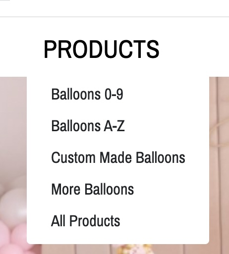


- As a user I want to be able to view a category of all products, so I can find products I'm interested in without having to search through all the products.

When navigating to products in the navigation bar. It will open in a drop-down box. There you can easily look up the categories.


- As a user I want to be able to view the product individually, so I can identify product image, price, description and product rating.

When opening the product page. you see the products on a desktop page in rows of 4. If you click on the image, the page will open and you will see the product in a larger size. If you want this product you can easily indicate that by adding it to the shopping bag.

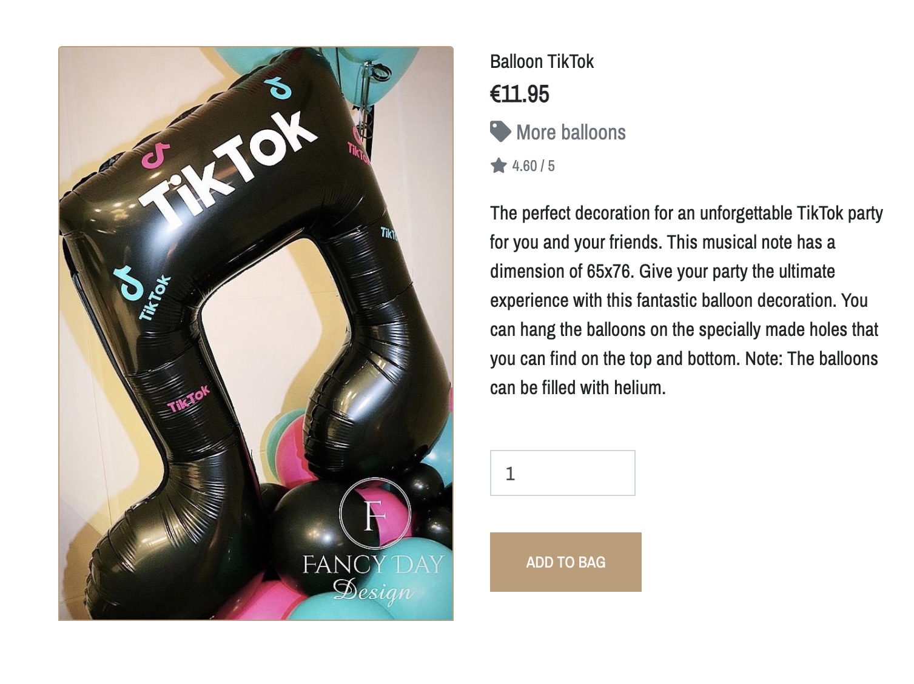


- As a user I want to be able to view my shopping bag anytime to see my total, so I can see what my total costs are at any time

Once you've added products to your bag, you can find them by clicking the bag icon at the top right. This will take you to view the shopping bag page. 
If you do not have any items in your bag, you will receive a message that says "There are no products in your bag yet. Look at his products. You will find a button that takes you to the products page.

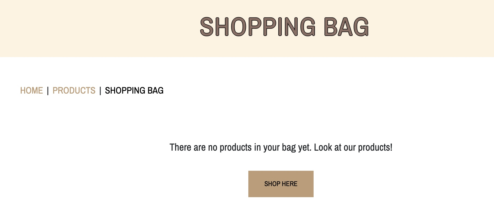


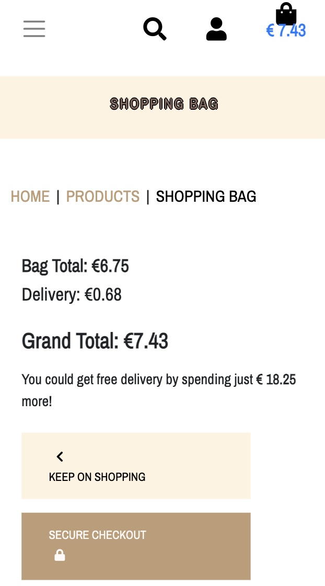


- As a user I want to be able to search for a product by keyword, name or descriptions, so I can find a specific product I want to buy.

There is a search bar in the top left corner of the page. By using keywords, you can easily find what you are looking for.

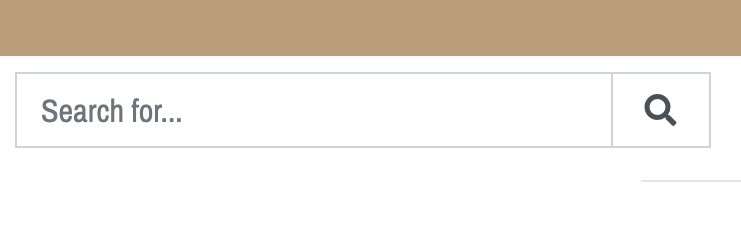


- As a user I want to be able to select the quantity of a product when purchasing, so I can make sure I don't accidentally buy the wrong product or quantity.

On the product detail page, you can increase or decrease the quantities of a product by means of an arrow in the quantity box.

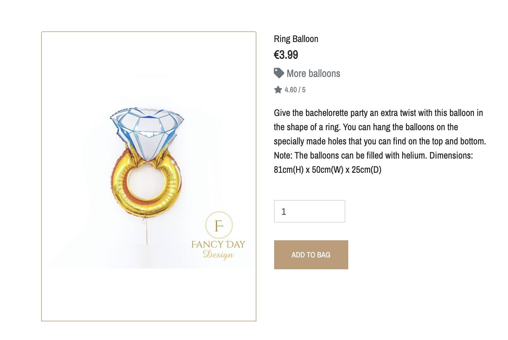


- As a user I want to be able to view items in my shopping bag, so I can see the total cost of my purchase and all the items I will receive

When you click on the bag icon, you will be taken to the shopping bag page. here you can see all the products you have in your bag.


- As a user I want to be able to adjust the number of individual items in my bag, so I can change my purchase before I check out.


When you are on the shopping bag page, you can easily adjust your quantities before purchasing.

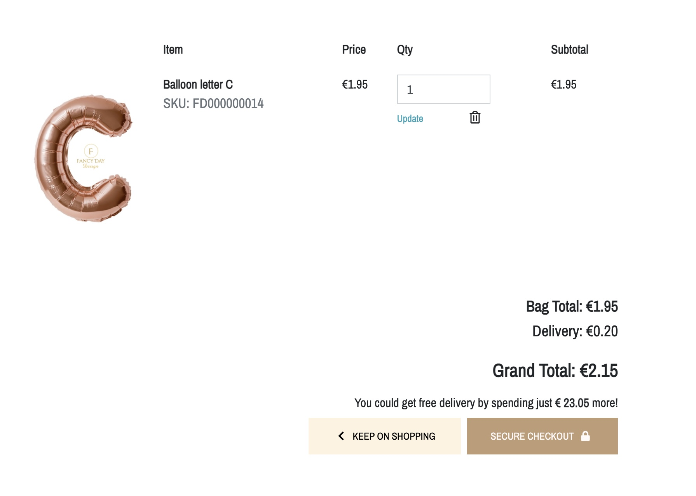


- As a user I want to be able to simply enter my payment details, so I can pay quickly and easily

You can easily make a payment via credit card via our secure checkout page.


- As a user I want to be able to view an order confirmation after checkout, so I can check that I haven't made any mistakes.

When the payment has been completed, you will see an overview on the road site. A confirmation email will also be sent to the provided email address.

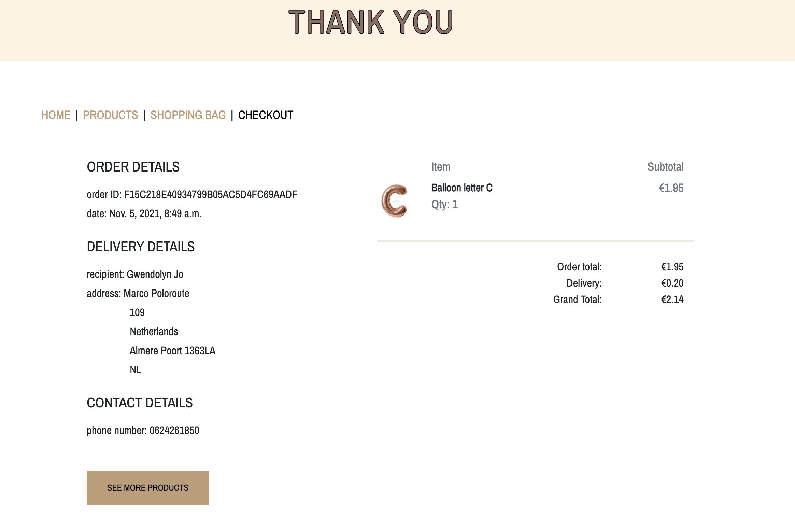

You will also see a success message at the top right when the payment is successful.


- As a user I want to be able to receive an email confirmation after checking out, so I can keep the order confirmation of what I bought for my own administration

A confirmation email will also be sent to the provided email address.


** Returning Users **
- As a returning user I want to be able to easily register for an account, so I can view my profile and have a personal account

You can easily create an account. By clicking on "my account" at the top right of the bag icon, you will be redirected to the page to register.
When you order something for the first time, you also get the option to save the data and create an account at the same time.

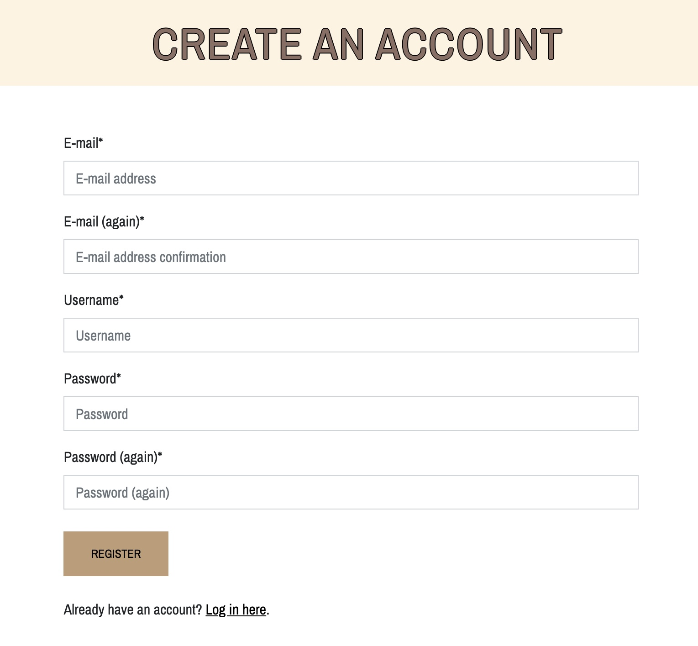


- As a returning user I want to be able to login or logout, so I can access my personal account.

If you have a login account, you can easily log in and out. You then create a profile page. Here you can see what you have ordered in the past. Or view your new order. You can also change your profile information.

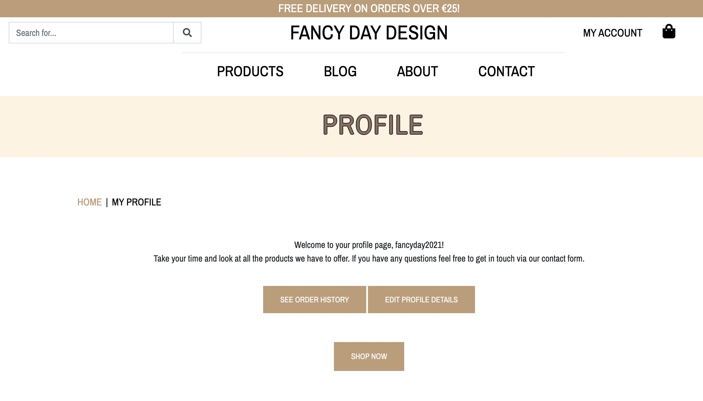

- As a returning user I want to be able to recover my password in case I forget it, so I can restore access to my account

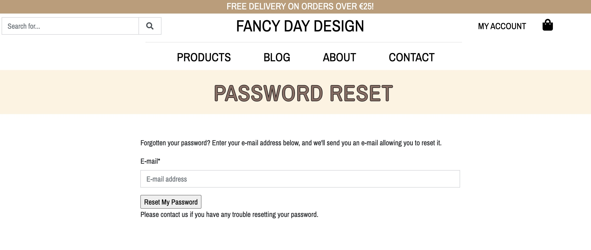


- As a returning user I want to be able to receive an email confirmation after registering, so I can verify that my account registration was successful

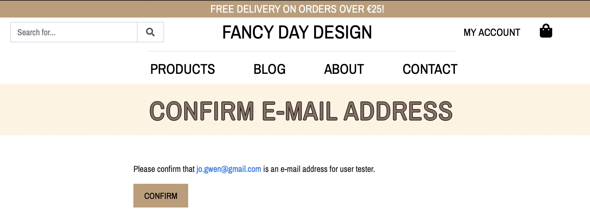

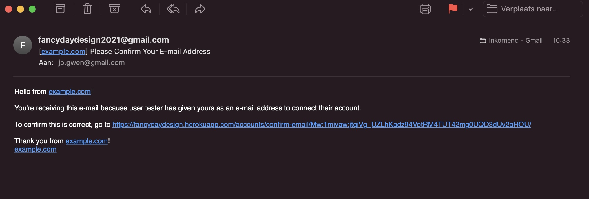


- As a returning user I want to be able to have a user profile, so I can view my personal order history and order confirmations.

If you have a login account, you can easily log in and out. You then create a profile page. Here you can see what you have ordered in the past. Or view your new order. You can also change your profile information.

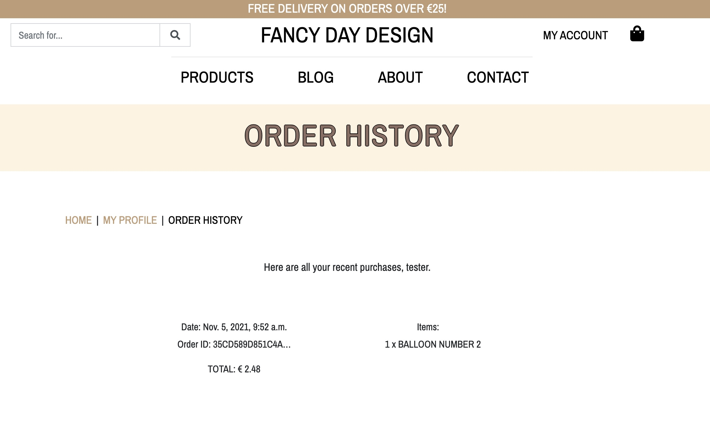

- As a returning user I want to be able to leave a comment on the website, so I can comment and read from other site users

registered and unregistered users can leave a comment on the blog page.

** Site owner’s Goal (admin): **

- As a site owner I want to be able to add a product, so I can add new items to my shop

Only an admin user can add new products. You can do this yourself via the ADMIN page or if you are logged in as an admin.

- As a site owner I want to be able to edit/update a product, so I can update/edit a product when necessary. 

Only an admin user can add new products. You can do this yourself via the ADMIN page or if you are logged in as an admin.

- As a site owner I want to be able to delete a product, so I can remove items that are no longer available.

#### Further testing
The website has been tested on multiple browsers such as:
- Safari (IOS) – The website works as it should in Safari
- 		Google Chrome - The website works as it should in Google Chrome

The website has been tested on various devices such as:
-	Laptop (13 inch Macbook air)
-  	Ipad mini

## Home page
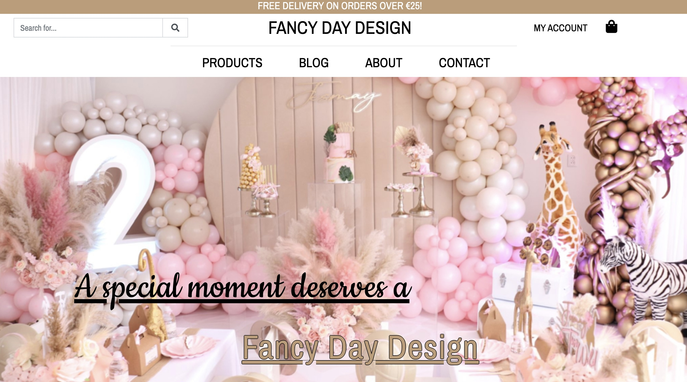

On the homepage you will find a hero image with the motto title: A special moment deserves a
Fancy Day Design. Then 3 images to be inspired. At the bottom of the homepage are testimonials from happy customers.

When you go to the homepage and scroll down to the testimonials. The testimonials carousel moves on its own. The carousel works as it should.

## Navbar + Delivery Information Banner

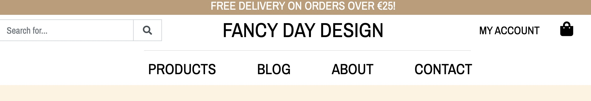

The navigation bar is visible on all pages. On a smaller device/page, it turns into a bar. The navigation bar contains a search bar, the name of the website (Fancy Day Design), a link to your account and a shopping bag.

The delivery information banner appears at the top of the navigation bar on every page and is fully mobile responsive and responsive to screen size changes.
The delivery banner gives a clear message that the user has to spend €25 euros to get free delivery.

The navigation bar remains consistent at the top of every page. It contains the most important links and navigation throughout the site. The navbar contains product categories on the site via a drop-downs.

The navigation bar is mobile responsive and responds to changes in screen size. It also enables a collapsible bar menu on mobile screens.


## Footer

The footer contains three sections, the first section contains the location of the store, in the middle section you will find links that lead you to different pages of the website and the third section refers to the social media links.
There is a search bar on every page, you can easily search products by name and/or keyword. A
The social media icons will have an underlined hover in place. The title will underline when u hover over it. All links on the footer have been tested and work properly.

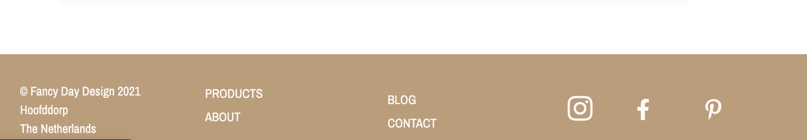

## Products

## All Products
The navigation bar at the top of the page shows all product categories on the site for ease of use for the user. The categories to choose from are;
*   Balloons 0-9
*   Balloons A-Z
*   Custom Made Balloons
*   More Balloons and
*   All Products

The 'All products' view shows every item for sale on the site.

A user can sort the products throughout the site by name and price by choosing from the select drop-down menu at right side of the page.
All links and buttons have been tested and work properly, on desktop and mobile.

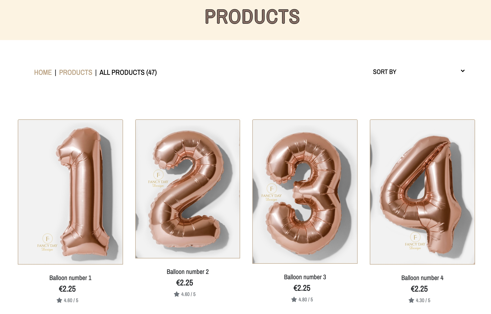


## Product details page
The product detail page contains all information related to the product, quantity and a button for adding the product to the shopping bag.

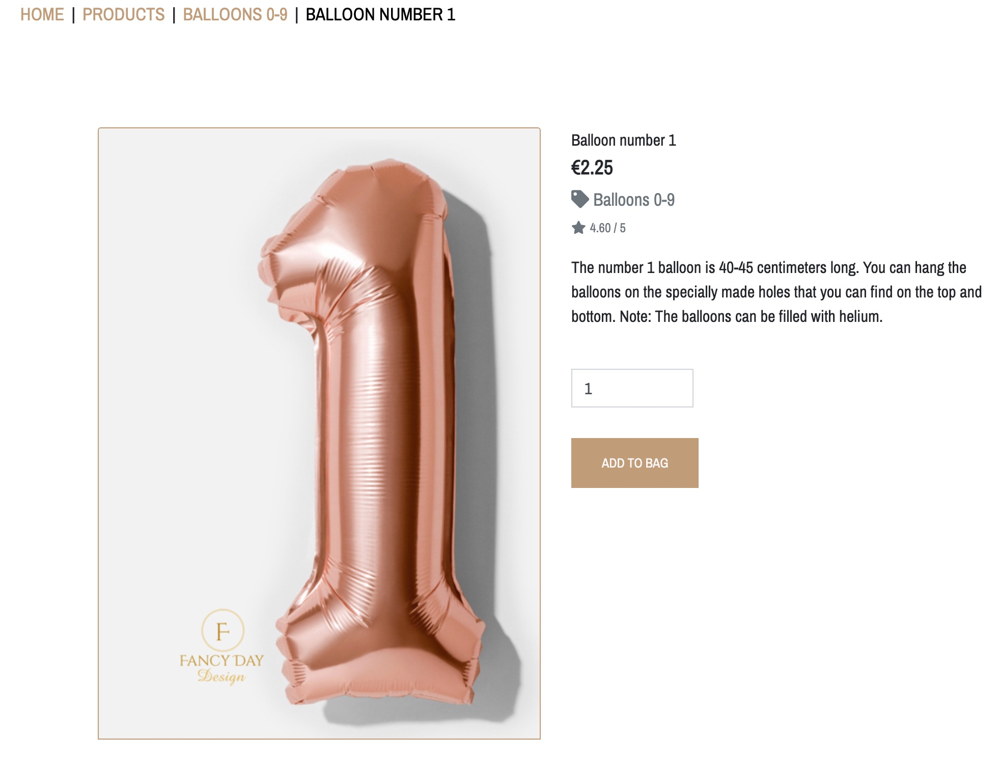
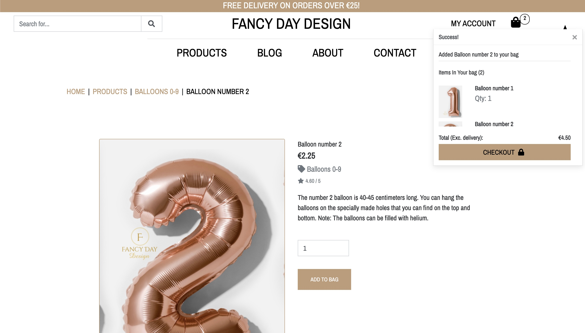


## Reviews section
Anyone can view the reviews of the products. When a review has been given about a certain product, it will be at the bottom of the page. 
Only logged in users can leave a product review in this section.
When logged in all links and buttons have been tested and work properly, on desktop and mobile.
All links and buttons have been tested and work properly, on desktop and mobile.


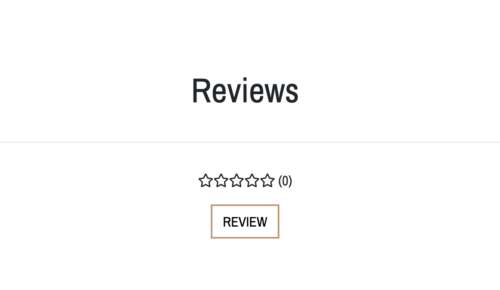

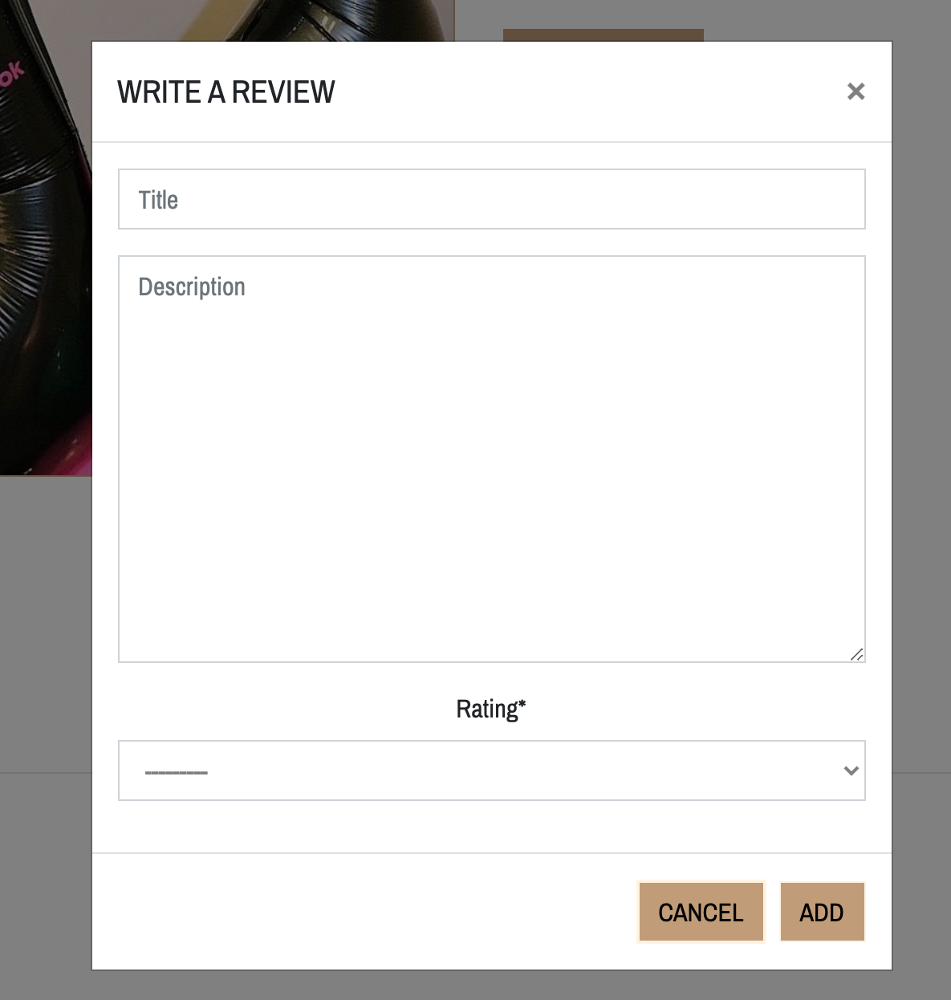

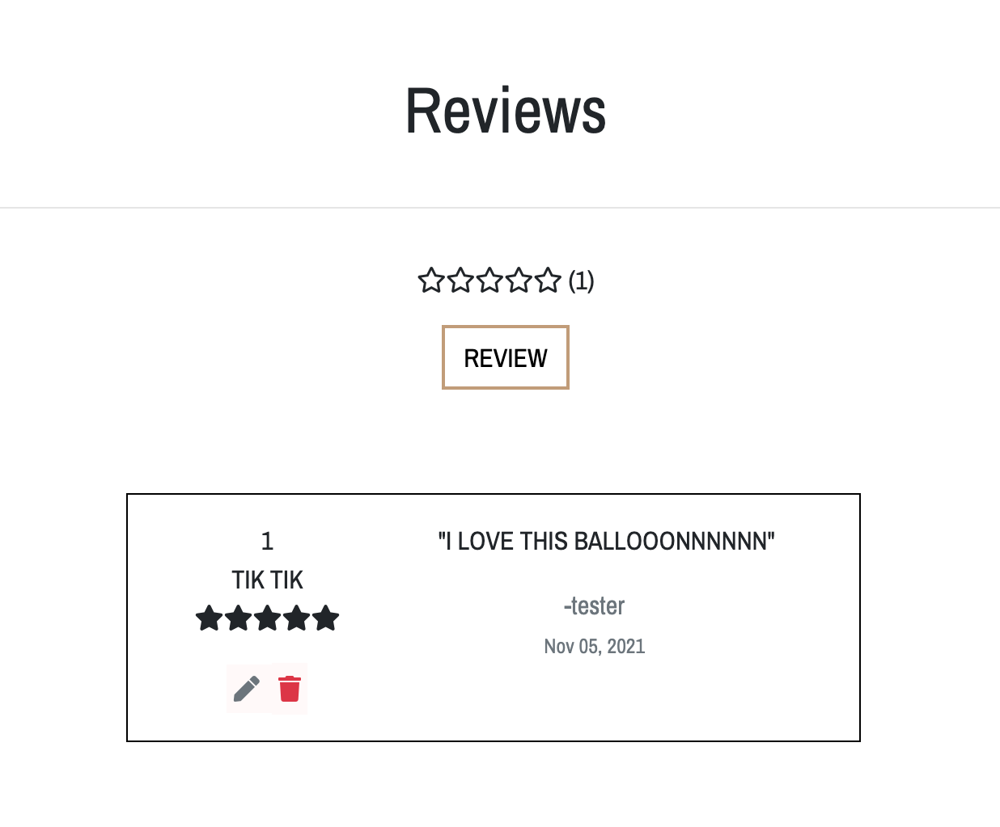


## Blog page
The blog page contains short summarized articles about Fancy Day Design. when you click on "read the full blog post" it will take you to the full article. 
The blog post also shows any comments made on the post. Any user can read and leave a comment.
Add Blog Post button is displayed at the top of the page, providing an easy way for admins to add a blog post to the site. The button is not displayed for regular users.
All links and buttons have been tested and work properly, on desktop and mobile.

## Blog Post page
Blog Post Page is a single page with all the details of a relevant blog post. It contains the main text, images and a comment section. The blog post shows any comments made on the post. Any user can read comments, but only logged in users can leave a comment.

## Add BlogPost page
Only a admin/superusers will be able to access this page.
This page can be accessed by clicking on add blog post button at the top of the blog page for admin users only can see this button.


## About Page
On this page you will find information about who Fancy Day design is. Also, on this page is a small gallery. Clicking on the image, will open the image on another page.
All links have been tested and work properly, on desktop and mobile.


## Bag
In the top right navigation bar, there is a bag icon. Once a user adds an item to the bag, the number of added products will be added to the top of the bag
to stand. When a user clicks on the bag icon, they are taken to the bag page.

When a user clicks the bag icon while they have no items in the bag a message will appear stating "There are no products in your bag yet. Check out our products!" below the message will be a button that will direct you back to the products page.
All links and buttons have been tested and work properly, on desktop and mobile.


## Checkout
When the user has items in his bag, a secure checkout button appears. When he clicks this checkout button, he is taken to the checkout page where he can complete his order and pay for his order via stripe.

When the user completes their order, a loading overlay appears until the order is confirmed. When the order is confirmed, a checkout success page with the details of the order will appear to the user.
All links and buttons have been tested and work properly, on desktop and mobile.


## Contact form
I have tried to make this contact form work. But due to time constraints I couldn't do this.

You can fill in everything but it will give an error if you want to send it.

I am aware of this issue and I will be addressing it in the near future so that everything works as it should.

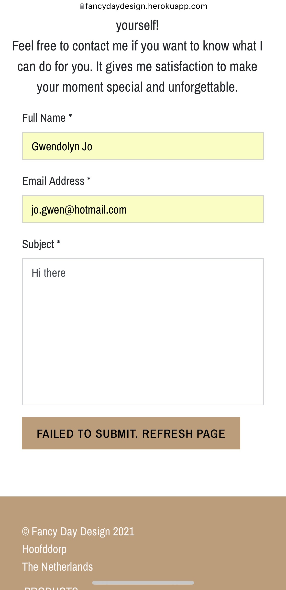


**Lighthouse**

Desktop


  


## **Fixed Issues**

I am aware that there are several bugs in my code. I ran out of time. As a single parent of three, I don't have much choice. I also work full time. My deadline is now. Because I didn't have time I couldn't have contact with my mentor

I have not been able to perform all the tests.


## **Deployment**
---
#### Deployment to Heroku

1.  Create an app on the Heroku website called fancydaydesign

    * Click on "New" button.
    * Click on the "Create new app".
    * Create "App name" > fancydaydesign and chose "Choose a region" > europe as my closest region.
    * "Create app".

2. Set up Postgres database.

    Heroku:
    * Click "Resources" and search for postgres.
    * Chose "add to project" and chose the free plan for my project.
    * In order to use Postgres, Install two dependecies in gitpod;
        dj_database_url and psycopg2
    
    Gitpod:
    * To install dj_database_url and psycopg2 use the command:
          * `pip install`
    * Use the command: pip3 freeze > requirements.txt, to add the dependencies to the requirements file which is needed by Heroku.
        * In settings.py import dj_database_url:
            * `import dj_database_url`
        * Commented out the current database settings and replaced it with the settings of the postgres database:
        ```
        DATABASES = {
            'default': dj_database_url.parse('DATABASE_URL')
        }
        ```
        * DATABASE_URL above is an environmental variable and as such should not be shown in version control. The database url can be found from your app config settings in heroku.
        * Once the above method is set up, the models need to be migrated to the new database using the command below:
            * `python3 manage.py migrate`
        * Create a new superuser for my site on heroku using the command below:
            * `python3 manage.py createsuperuser`
        * Commit the changes and make sure not to include environmnet variables in the version control.
        * Created an if-else statement in the settings.py to use Postgres if the DATABASE_URL variable is available and otherwise use the default database in gitpod.
        ```
        if "DATABASE_URL" in os.environ:
                DATABASES = {
                    "default": dj_database_url.parse(os.environ.get('DATABASE_URL'))
                }
          else:
                DATABASES = {
                    'default': {
                        'ENGINE': 'django.db.backends.sqlite3',
                        'NAME': BASE_DIR / 'db.sqlite3',
                    }
                }
        ```
        * The postgres database is now be ready for use.

    Gunicorn:
        * For the app to work on heroku. Instal Gunicorn
            * `pip3 install Gunicorn`
        * Create a Procfile to tell heroku how to run our app.
            * `touch Procfile`
        * In Procfile add:
            * `web: gunicorn <appname>.wsgi:application`
    
    * Connect to Heroku in the terminal on gitpod
        * `heroku login -i`
        * Login with your email and password that you used to create an account with on heroku website.
        * Disable the collection of static files temporarily until AWS has been set up.
            * `heroku config:set DISABLE_COLLECTSTATIC=1 --app <appname>`
            * Use the --app command when you have more than one app in your heroku account
        * In settings add heroku into my list of allowed hosts, and localhost so the project can still b run locally using the following settings.
            * `ALLOWED_HOSTS = ["<heroku appname>.herokuapp.com", "localhost"]`
        * Push to Github 
        * Push to Heroku. first
            * `heroku git:remote -a <heroku appname>`
        * Then push the project to Heroku using:
            * `git push heroku master`
    
    Go back to Heroku Website;
        * Go to the deploy section of the app.
        * Search for the app being used in github.
        * When found connected and click on "Enable Automatic deploys"
        * Any changes made and pushed to Github will automatically be pushed to Heroku.
    
    Amazon AWS;
    * Create an AWS account.
        * Create a bucket.
                * Search for AWS S3 service.
                    * Click on "Create Bucket".
                        * Give the bucket a unique name and then select the region.
                                * Uncheck the block public access and acknowledge that the bucket will now be public.
                                    * Click create bucket.
        * Bucket settings
            * Properties
                * Go to the bucket Properties section
                * Turn on static website hosting
                * In the index and error text inputs, add index.html and error.html.
                * Click save.
        * Permissions
            * Go to the bucket Permissions section.
            * In the cors config paste in the below code:
                * ```
                    [
                        {
                            "AllowedHeaders": [
                                "Authorization"
                            ],
                            "AllowedMethods": [
                                "GET"
                            ],
                            "AllowedOrigins": [
                                "*"
                            ],
                            "ExposedHeaders": [

                            ]
                        }
                    ]
                  ```
            * Click on the generate policy, in the bucket policy.
        * Policy
            * Select S3 bucket policy.
            * Add * to the principal field to select all principals.
            * select action to get object.
            * Paste in your ARN which can be found on the bucket policy page.
            * Click add statement.
            * Click on the generate policy button.
            * Copy and paste the new policy into your bucket policy.
            * Add /* onto the end of the resources key.
            * and, click save.
        * Access Control List
            * Go to the Access Control List section.
            * set list objects permission to everyone.
    
    * Create a new user

        * Search for IAM to add a new user
        * Create a group
            * Create a group to put our user in
            * Click create a new group and name it.
            * Click through to the end and save the group.
            * Create a group policy
                * Click policy and the click create policy
                * Select the JSON tab and import managed policies.
                * Search S3 and select on Amazons3fullaccess and import.
                * paste in the ARN, in the resources section.
                * Click through to review policy.
                * Fill in the name and description and click generate policy.
            * Click on permission and attach the policy.
            * Find the policy and attach it.

        * Create the user
            * Select users from the sidebar and click on "add user"
            * Create a username and select programmatic access click on next.
            * Select the group to add your user.
            * Click through to the end and click create user.
            * Download the CSV file containing the user keys needed to access the app.
    
    * Connect bucket to Django
        * Install two packages in the IDE, boto3 and django-storages:
            * ```
                pip3 install boto3
                pip3 install django-storages
              ```
        * add to requirements use;
            * `pip3 freeze > requirements.txt`
        * Add storages to installed apps in settings.py
        * An environment variable called USE_AWS needs to be set up to run the code on heroku.
        * The settings needed for the project in the settings.py file are below:
            * ```
                if "USE_AWS" in os.environ:
                    # Bucket configurations
                    AWS_STORAGE_BUCKET_NAME = "<bucket name>"
                    AWS_S3_REGION_NAME = "<bucket region>"
                    AWS_ACCESS_KEY_ID = os.environ.get("AWS_ACCESS_KEY_ID") # taken from downloaded csv file
                    AWS_SECRET_ACCESS_KEY = os.environ.get("AWS_SECRET_ACCESS_KEY") # taken from downloaded csv file
                    AWS_S3_CUSTOM_DOMAIN = f'{AWS_STORAGE_BUCKET_NAME}.s3.amazonaws.com'

                    # static and media files
                    STATICFILES_STORAGE = "custom_storages.StaticStorage"
                    STATICFILES_LOCATION = "static"
                    DEFAULT_FILE_STORAGE = "custom_storages.MediaStorage"
                    MEDIAFILES_LOCATION = "media"

                    # now need to override static and media Urls for production
                    STATIC_URL = f'https://{AWS_S3_CUSTOM_DOMAIN}/{STATICFILES_LOCATION}/'
                    MEDIA_URL = f'https://{AWS_S3_CUSTOM_DOMAIN}/{MEDIAFILES_LOCATION}/'
              ```
        * In heroku click on settings tab and click reveal config vars.
        * Set up the environmental variables as required.
        * Create a custom storages.py in the IDE, to tell django we want to use Amazon S3 to store our static and media files.
        * Import S3Boto3Storage at the top of the custom_storages.py file.
        * Set up classes to tell django where to store the files as shown below:
            * ```
                class StaticStorage(S3Boto3Storage):
                    location = settings.STATICFILES_LOCATION
                
                class MediaStorage(S3Boto3Storage):
                    location = settings.MEDIAFILES_LOCATION
              ```
        * push all the changes to Github from the IDE
    
    * Add Media files to AWS
        * Create a new folder called media in your AWS bucket
        * Select upload all image files.
        * Select to grant public access.
        * Click to upload your files.

# Credits <a name="credits"></a>

### Content and Media

Carousel - testimonials
-https://www.w3schools.com/howto/howto_js_slideshow.asp

THIS PROJECT IS FOR EDUCATION USE ONLY

For the main foundation of this website I used videos from Code Institute - Project - Boutique Ado. Then I modified it to this website.


The content of the about.html page is written by Shakira Lacroes the owner (and my sister in law) of Fancy Day Design.

**Code I have used**
Used websites and images:

Review Forms and Add to Database using forms | Build Movie Review Website Using Django 2020.
[video](https://www.youtube.com/watch?v=lSX8nzu9ozg)

[Building A Blog Application With Django](https://djangocentral.com/building-a-blog-application-with-django/)

Wat is een blog? [Dutch Page](https://www.blogkracht.nl/wat-is-een-blog/) 

Create A Simple Django Blog from [Codemy.com](https://www.youtube.com/results?search_query=make+a+blog+with+django)

* [bootstrap 5](https://getbootstrap.com/) was used to style the site and to make it more visually appealing for the reader and user.

* Some of the backend code was taken from the walkthrough project of Boutique Ado and some frontend bootstrap classes are similar to what was used in the walthrough project as I wanted a similar feel for my site.


### Media

Most of the images used for the website were made by Shakira Lacroes (owner). To fill up the product page I used some other pictures from pexels.com and adobe stock.
Obtained from Pexels.com: 

-	Ring Balloon & Happy Birthday Balloon - Polina Tankilevitch

-	Love Balloon - Cottonbro

Obtained from stock.adobe.com/nl/free: 

-	All-numbers balloon. From this image I took all the individual photos of the numbers and used them for the products.

-	All-Alphabet letters balloon. From this image I took all the individual photos of the letters and used them for the products.

-	Gender reveal balloon.


### Acknowledgements

*   Student Care

*   I want to thank my friends and family who have viewed my website multiple times, have given me good criticism on my website and for putting up with my moodiness these past few weeks.

*   I would also want to thank my mentor who believed in me that I can do this project in 3 weeks and my fellow student Daphne for always staying positive!

*   The Slack community!

**THIS PROJECT IS FOR EDUCATIONAL USE ONLY**
